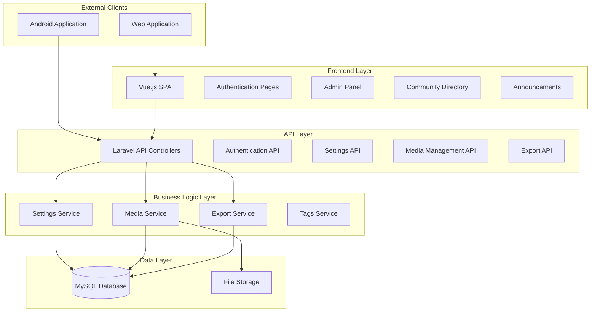

# Design Document

## Overview

This design document outlines the architecture and implementation approach for enhancing the admin panel of a Laravel application with Vue.js frontend. The system serves both web users and Android applications via API endpoints. The enhancements focus on settings management, announcements with multiple image support, community directory improvements, frontend authentication, and business registration features.

The design follows Laravel's MVC architecture with Vue.js as the frontend framework, utilizing existing database tables (settings, tags, media, contact_books, banners) while maintaining API compatibility for both web and mobile clients.

## Architecture

### System Architecture



### Database Schema Integration

The design leverages existing database tables:

- **settings**: Manages maintenance mode and registration permissions
- **media**: Stores file metadata for all uploaded images
- **tags**: Categorizes contacts by profession/skill/business/service
- **contact_books**: Community directory entries
- **banners**: Announcement data with media relationships

## Components and Interfaces

### 1. Settings Management Component

**SettingsController Enhancement**
- Extends existing settings API to include maintenance mode and registration control
- Provides structured JSON responses for both web and mobile clients

**SettingsService**
- Manages settings retrieval and updates
- Handles maintenance mode state validation
- Provides registration permission checks

**API Endpoints:**
```php
GET /api/settings - Returns all settings including maintenance_mode and allow_registration
PUT /api/settings/{key} - Updates specific setting value
GET /api/maintenance-status - Dedicated endpoint for maintenance status
```

### 2. Media Management Component

**MediaController Enhancement**
- Handles multiple image uploads for announcements
- Implements image resizing using Intervention Image library
- Manages file organization in structured folders

**MediaService**
- Processes image uploads and resizing
- Maintains media table relationships
- Implements consistent file naming and storage patterns

**Image Processing Pipeline:**
1. Validate uploaded files (type, size, dimensions)
2. Resize images to multiple sizes (thumbnail, medium, large)
3. Store files in organized folder structure
4. Save metadata to media table with relationships

### 3. Community Directory Component

**ContactController Enhancement**
- Implements CRUD operations with improved form handling
- Provides tag-based filtering and search functionality
- Supports pagination with 20 items per page

**ContactService**
- Manages contact data operations
- Handles tag relationships and filtering
- Implements search functionality across multiple fields

**Frontend Components:**
- ContactForm: Medium-sized modal with proper field alignment
- ContactList: Paginated listing with search and filter capabilities
- ContactDetail: Structured detail page with breadcrumb navigation
- TagFilter: Scrollable tag selection interface

### 4. Export System Component

**ExportController**
- Generates CSV, Excel, and PDF exports
- Implements custom headers and footers
- Adds watermark functionality for PDF exports

**ExportService**
- Utilizes Laravel Excel package for CSV/Excel generation
- Implements PDF generation with custom styling
- Manages export job queuing for large datasets

**Export Features:**
- Custom headers with brand information
- Page numbering in footer format (currentpage/allpages)
- Watermark integration with brand logo
- Support for all contact details in exports

### 5. Authentication Enhancement Component

**AuthController Modifications**
- Extends registration functionality with additional fields
- Implements proper validation for both server and client side
- Maintains API compatibility for mobile authentication

**Registration Form Fields:**
- Full name (required, string, max:255)
- Email (required, email, unique:users)
- Password (required, min:8, confirmed)
- Mobile number (required, regex pattern for phone validation)

### 6. Announcements Enhancement Component

**AnnouncementController Enhancement**
- Supports multiple image associations per announcement
- Implements search and date-based filtering
- Provides pagination consistent with community directory

**AnnouncementService**
- Manages announcement-media relationships
- Implements search functionality
- Handles date-based filtering logic

## Data Models

### Enhanced Models

**Setting Model**
```php
class Setting extends Model
{
    protected $fillable = ['type', 'key', 'value', 'description'];
    protected $casts = [
        'value' => 'json'
    ];
    
    public static function getMaintenanceMode(): bool
    public static function getAllowRegistration(): bool
    public static function getMaintenanceNote(): string
}
```

**Media Model Enhancement**
```php
class Media extends Model
{
    protected $fillable = [
        'model_type', 'model_id', 'file_path', 'file_name', 
        'mime_type', 'file_size', 'is_primary', 'uploaded_by'
    ];
    
    public function model(): MorphTo
    public function getUrlAttribute(): string
    public function getThumbnailUrlAttribute(): string
}
```

**ContactBook Model Enhancement**
```php
class ContactBook extends Model
{
    protected $fillable = [
        'name', 'designation', 'department', 'phone', 'email', 
        'address', 'description', 'type', 'is_active', 'sort_order'
    ];
    
    public function tags(): BelongsToMany
    public function media(): MorphMany
    public function scopeByTag($query, $tagId)
    public function scopeSearch($query, $searchTerm)
}
```

**Tag Model Enhancement**
```php
class Tag extends Model
{
    protected $fillable = ['name', 'slug', 'category', 'is_active'];
    
    public function contacts(): BelongsToMany
    public function scopeByCategory($query, $category)
    public function scopeActive($query)
}
```

### Database Relationships

- ContactBook hasMany Media (polymorphic)
- ContactBook belongsToMany Tags
- Announcement hasMany Media (polymorphic)
- Media belongsTo User (uploaded_by)
- Tag belongsToMany ContactBook

## Correctness Properties

*A property is a characteristic or behavior that should hold true across all valid executions of a system-essentially, a formal statement about what the system should do. Properties serve as the bridge between human-readable specifications and machine-verifiable correctness guarantees.*

Before defining the correctness properties, I need to analyze the acceptance criteria from the requirements document to determine which ones are testable as properties.

### Property 1: Maintenance Mode State Management
*For any* system configuration, when maintenance mode is toggled, the frontend should display maintenance page when enabled and normal content when disabled, while the API should return consistent maintenance status information.
**Validates: Requirements 1.1, 1.2, 1.3, 1.5**

### Property 2: Registration Control State Management  
*For any* registration permission setting, when "Allow Self Registration" is toggled, the frontend should show/hide registration forms and create account options consistently with the setting state.
**Validates: Requirements 2.1, 2.2, 2.3**

### Property 3: Multiple Image Upload Support
*For any* announcement creation or editing operation, the system should accept multiple image uploads and associate all uploaded images with the announcement.
**Validates: Requirements 3.1, 3.4**

### Property 4: Image Processing and Storage Consistency
*For any* uploaded image, the system should resize the image appropriately, store it in the correct folder structure, save complete metadata to the Media_Table, and use the Media_Table for all image storage operations.
**Validates: Requirements 3.2, 3.3, 13.2, 14.1, 14.2, 14.3, 14.5**

### Property 5: Form Responsiveness
*For any* form displayed on mobile devices, when content exceeds the viewport, the form should be scrollable to ensure all content is accessible.
**Validates: Requirements 4.3**

### Property 6: Image Preview Functionality
*For any* image upload operation, the system should provide a clear preview of the uploaded image immediately after upload.
**Validates: Requirements 4.5**

### Property 7: Export Format Support
*For any* export request, the system should successfully generate the requested format (CSV, Excel, or PDF) and include all contact details in the output.
**Validates: Requirements 5.1, 5.2**

### Property 8: Export Header Completeness
*For any* export operation, the generated file should include a header containing Brand Name, Tagline, Logo, Support Phone, and Support Email.
**Validates: Requirements 5.3**

### Property 9: PDF Export Formatting
*For any* PDF export, the document should include proper page numbering in "currentpage/allpages" format and a watermark of the brand logo with light opacity.
**Validates: Requirements 5.4, 5.5**

### Property 10: Tag Management Operations
*For any* tag addition or assignment operation, the system should allow adding tags from the Tags_System, maintain proper relationships between contacts and tags, support all tag categories, and validate assignments against existing definitions.
**Validates: Requirements 6.1, 6.3, 6.4, 6.5**

### Property 11: Registration Form Validation
*For any* registration form submission, the system should implement both server-side and client-side validation, rejecting invalid data and providing appropriate error messages.
**Validates: Requirements 7.5**

### Property 12: Tag-Based Search Functionality
*For any* tag selection in the directory, the system should return only contacts that are associated with the selected tags, and the tag selection should work consistently with existing filtering functionality.
**Validates: Requirements 8.2, 8.5**

### Property 13: Filter Interface Interaction
*For any* filter icon click, the system should display a scrollable list of all available tags for selection.
**Validates: Requirements 8.4**

### Property 14: Contact Detail Display Completeness
*For any* contact detail page, all user details including skills and blood group should be displayed in the appropriate sections.
**Validates: Requirements 9.4**

### Property 15: Pagination Consistency
*For any* paginated list (contacts or announcements), exactly 20 items should be displayed per page, with proper pagination information showing current page and total pages.
**Validates: Requirements 10.1, 10.4, 11.4**

### Property 16: State Persistence Across Navigation
*For any* applied search or filter state, when navigating between pages, the system should maintain the current search and filter criteria.
**Validates: Requirements 10.3**

### Property 17: Cross-Platform Navigation
*For any* navigation operation, the functionality should work seamlessly on both web and mobile interfaces.
**Validates: Requirements 10.5**

### Property 18: Announcement Search and Filtering
*For any* search query or date filter applied to announcements, the system should return only announcements that match the specified criteria.
**Validates: Requirements 11.2, 11.3**

### Property 19: Business Registration Validation and Integration
*For any* business registration submission, the system should validate the data appropriately and integrate the registration with the existing user management system.
**Validates: Requirements 12.4, 12.5**

### Property 20: Cross-Platform API Compatibility
*For any* API endpoint, the functionality should work consistently for both frontend and Android application clients, maintaining existing database relationships and implementing proper error handling.
**Validates: Requirements 13.1, 13.3, 13.5**

## Error Handling

### API Error Responses
- Standardized error response format for both web and mobile clients
- Proper HTTP status codes for different error types
- Detailed error messages for validation failures
- Graceful degradation for maintenance mode scenarios

### File Upload Error Handling
- File size and type validation with clear error messages
- Storage failure recovery mechanisms
- Rollback procedures for failed multi-image uploads
- Disk space monitoring and alerts

### Export Error Management
- Timeout handling for large export operations
- Memory management for PDF generation with watermarks
- Fallback mechanisms for failed export operations
- User notification system for export completion/failure

### Database Error Handling
- Transaction rollback for failed operations
- Relationship integrity validation
- Duplicate key handling for tag assignments
- Connection failure recovery mechanisms

## Testing Strategy

### Dual Testing Approach

The testing strategy employs both unit testing and property-based testing to ensure comprehensive coverage:

**Unit Tests:**
- Focus on specific examples, edge cases, and error conditions
- Test integration points between Laravel controllers and Vue.js components
- Validate specific UI interactions and form submissions
- Test error handling scenarios and edge cases

**Property-Based Tests:**
- Verify universal properties across all inputs using generated test data
- Test system behavior with randomized inputs to catch edge cases
- Validate data integrity and consistency across operations
- Ensure API compatibility across different client types

**Property-Based Testing Configuration:**
- Use Laravel's built-in testing framework with PHPUnit for backend property tests
- Implement Vue Test Utils with Jest for frontend property testing
- Configure each property test to run minimum 100 iterations
- Tag each test with format: **Feature: admin-panel-enhancements, Property {number}: {property_text}**

**Testing Libraries:**
- **Backend**: PHPUnit with Laravel's testing utilities for property-based testing
- **Frontend**: Jest with Vue Test Utils for component testing
- **API Testing**: Laravel's HTTP testing for endpoint validation
- **Database Testing**: Laravel's database testing utilities with transactions

**Test Coverage Requirements:**
- Each correctness property must be implemented by a single property-based test
- Unit tests complement property tests by covering specific scenarios
- Integration tests validate end-to-end workflows
- API tests ensure compatibility between web and mobile clients

**Test Data Management:**
- Use Laravel factories for generating test data
- Implement custom generators for complex data structures
- Maintain test database isolation using transactions
- Mock external dependencies and file storage operations