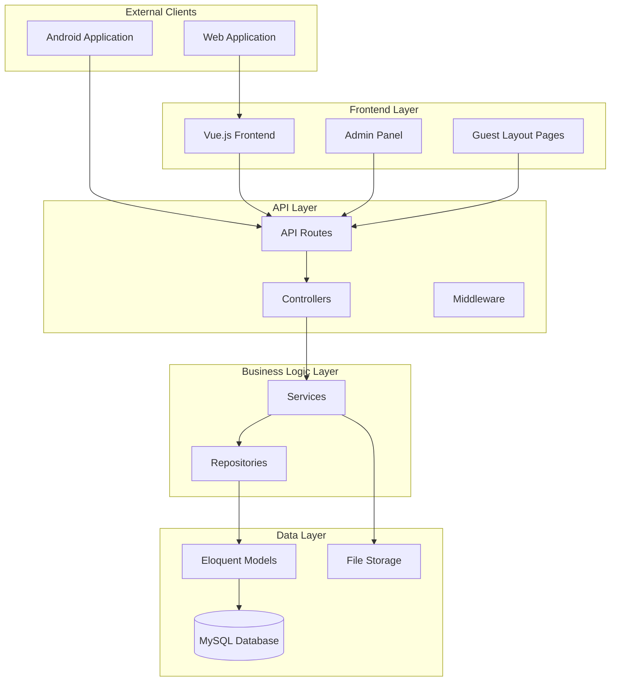

# Design Document

## Overview

This design document outlines the technical approach for enhancing a Laravel application with improved admin panel functionality, frontend user experience, and API compatibility. The solution maintains the existing Laravel + Vue.js architecture while adding new features for maintenance mode management, announcements system, community directory enhancements, and authentication improvements.

The design ensures backward compatibility with the existing Android application while providing a modern, responsive web interface. All components follow Laravel's service-repository pattern and maintain consistent API responses.

## Architecture

### High-Level Architecture



### Component Architecture

The enhancement follows Laravel's established patterns:

1. **Controllers**: Handle HTTP requests and responses
2. **Services**: Contain business logic and orchestrate operations
3. **Repositories**: Abstract data access layer
4. **Models**: Eloquent models with relationships
5. **Middleware**: Handle cross-cutting concerns (maintenance mode, authentication)
6. **Vue Components**: Frontend user interface components

## Components and Interfaces

### 1. Settings Management System

#### SettingsController Enhancement
```php
class SettingsController extends Controller
{
    public function update(UpdateSettingsRequest $request)
    {
        // Handle maintenance_mode and allow_self_registration
        // Return API response compatible with Android
    }
    
    public function getMaintenanceStatus()
    {
        // Return maintenance status for API consumers
    }
}
```

#### Settings Model Enhancement
```php
class Setting extends Model
{
    protected $fillable = [
        'maintenance_mode',
        'maintenance_note', 
        'allow_self_registration',
        // existing fields
    ];
    
    protected $casts = [
        'maintenance_mode' => 'boolean',
        'allow_self_registration' => 'boolean',
    ];
}
```

#### MaintenanceMiddleware
```php
class MaintenanceMiddleware
{
    public function handle($request, Closure $next)
    {
        if (Setting::isMaintenanceModeEnabled()) {
            if ($request->expectsJson()) {
                return response()->json([
                    'maintenance_mode' => true,
                    'maintenance_note' => Setting::getMaintenanceNote()
                ]);
            }
            return response()->view('maintenance');
        }
        return $next($request);
    }
}
```

### 2. Enhanced Announcements System

#### Notification Model Enhancement (Used for Announcements)
```php
class Notification extends Model
{
    protected $fillable = [
        'title',
        'message', 
        'images',
        'is_active',
        'created_by'
    ];
    
    protected $casts = [
        'images' => 'array',
        'is_active' => 'boolean'
    ];
    
    public function creator()
    {
        return $this->belongsTo(Admin::class, 'created_by');
    }
}
```

#### AnnouncementService (Using Notification Model)
```php
class AnnouncementService extends BaseService
{
    protected $notificationRepository;
    
    public function __construct(NotificationRepository $notificationRepository)
    {
        $this->notificationRepository = $notificationRepository;
    }
    
    public function store(array $data, array $images = [])
    {
        $processedImages = $this->imageProcessor->processMultiple($images);
        $data['images'] = $processedImages;
        return $this->notificationRepository->create($data);
    }
    
    public function update($id, array $data, array $images = [])
    {
        $notification = $this->notificationRepository->find($id);
        if (!empty($images)) {
            $processedImages = $this->imageProcessor->processMultiple($images);
            $data['images'] = array_merge($notification->images ?? [], $processedImages);
        }
        return $this->notificationRepository->update($id, $data);
    }
}
```

#### ImageProcessor Service
```php
class ImageProcessor
{
    public function processMultiple(array $images): array
    {
        $processedImages = [];
        foreach ($images as $image) {
            $processedImages[] = $this->process($image);
        }
        return $processedImages;
    }
    
    private function process(UploadedFile $image): string
    {
        // Resize image according to specifications
        // Store in designated folder structure
        // Return file path
    }
}
```

### 3. Community Directory Enhancement

#### ContactBook Model Enhancement
```php
class ContactBook extends Model
{
    protected $fillable = [
        'name',
        'email',
        'phone',
        'image',
        'skills',
        'blood_group',
        'address',
        // existing fields
    ];
    
    public function tags()
    {
        return $this->belongsToMany(Tag::class, 'contact_book_tags');
    }
}
```

#### Tag System Integration
```php
class Tag extends Model
{
    protected $fillable = ['name', 'slug', 'color'];
    
    public function contactBooks()
    {
        return $this->belongsToMany(ContactBook::class, 'contact_book_tags');
    }
}
```

#### Export Service
```php
class ExportService
{
    public function exportToCsv(Collection $data): string
    {
        // Generate CSV with branded headers
    }
    
    public function exportToExcel(Collection $data): string
    {
        // Generate Excel with branded headers
    }
    
    public function exportToPdf(Collection $data): string
    {
        // Generate PDF with watermark and branded headers/footers
    }
    
    private function addBrandedHeader(): array
    {
        return [
            'brand_name' => config('app.brand_name'),
            'tagline' => config('app.tagline'),
            'logo' => config('app.logo_path'),
            'support_phone' => config('app.support_phone'),
            'support_email' => config('app.support_email')
        ];
    }
}
```

### 4. Authentication System Enhancement

#### AuthController Enhancement
```php
class AuthController extends Controller
{
    public function showRegistrationForm()
    {
        if (!Setting::isRegistrationAllowed()) {
            return redirect()->route('login');
        }
        return view('auth.register');
    }
    
    public function register(RegisterRequest $request)
    {
        if (!Setting::isRegistrationAllowed()) {
            return response()->json(['error' => 'Registration disabled'], 403);
        }
        // Handle registration logic
    }
}
```

#### Registration Request Validation
```php
class RegisterRequest extends FormRequest
{
    public function rules()
    {
        return [
            'full_name' => 'required|string|max:255',
            'email' => 'required|email|unique:users,email',
            'password' => 'required|string|min:8|confirmed',
            'mobile' => 'required|string|max:20'
        ];
    }
}
```

### 5. Frontend Vue Components

#### MaintenanceMode Component
```vue
<template>
  <div v-if="maintenanceMode" class="maintenance-page">
    <div class="maintenance-content">
      <h1>System Maintenance</h1>
      <p>{{ maintenanceNote }}</p>
    </div>
  </div>
</template>
```

#### CommunityDirectory Component
```vue
<template>
  <div class="community-directory">
    <div class="filters">
      <SearchBox v-model="searchQuery" />
      <TagFilter :tags="availableTags" @filter="handleTagFilter" />
    </div>
    <ContactGrid :contacts="contacts" />
    <Pagination :pagination="pagination" @page-change="handlePageChange" />
  </div>
</template>
```

#### AnnouncementsList Component
```vue
<template>
  <div class="announcements-list">
    <div class="filters">
      <SearchBox v-model="searchQuery" />
      <DateFilter @filter="handleDateFilter" />
    </div>
    <AnnouncementCard 
      v-for="announcement in announcements" 
      :key="announcement.id"
      :announcement="announcement"
    />
    <Pagination :pagination="pagination" @page-change="handlePageChange" />
  </div>
</template>
```

## Data Models

### Database Schema Changes

#### Settings Table Enhancement
```sql
ALTER TABLE settings ADD COLUMN maintenance_mode BOOLEAN DEFAULT FALSE;
ALTER TABLE settings ADD COLUMN maintenance_note TEXT;
ALTER TABLE settings ADD COLUMN allow_self_registration BOOLEAN DEFAULT TRUE;
```

#### Notifications Table Enhancement (Used for Announcements)
```sql
ALTER TABLE notifications ADD COLUMN images JSON;
ALTER TABLE notifications ADD COLUMN is_active BOOLEAN DEFAULT TRUE;
-- Assuming title and message columns already exist
```

#### Contact Book Tags Pivot Table
```sql
CREATE TABLE contact_book_tags (
    id BIGINT UNSIGNED AUTO_INCREMENT PRIMARY KEY,
    contact_book_id BIGINT UNSIGNED,
    tag_id BIGINT UNSIGNED,
    created_at TIMESTAMP NULL DEFAULT NULL,
    updated_at TIMESTAMP NULL DEFAULT NULL,
    FOREIGN KEY (contact_book_id) REFERENCES contact_books(id) ON DELETE CASCADE,
    FOREIGN KEY (tag_id) REFERENCES tags(id) ON DELETE CASCADE,
    UNIQUE KEY unique_contact_tag (contact_book_id, tag_id)
);
```

### API Response Formats

#### Standard API Response
```json
{
    "success": true,
    "data": {},
    "message": "Operation successful",
    "maintenance_mode": false,
    "maintenance_note": null
}
```

#### Maintenance Mode Response
```json
{
    "success": false,
    "data": null,
    "message": "System under maintenance",
    "maintenance_mode": true,
    "maintenance_note": "We are performing scheduled maintenance. Please try again later."
}
```

#### Community Directory Response
```json
{
    "success": true,
    "data": {
        "data": [
            {
                "id": 1,
                "name": "John Doe",
                "email": "john@example.com",
                "phone": "+1234567890",
                "image": "/storage/contacts/john-doe.jpg",
                "skills": "Plumbing, Electrical",
                "blood_group": "O+",
                "tags": [
                    {"id": 1, "name": "Plumbers", "slug": "plumbers"},
                    {"id": 2, "name": "Electricians", "slug": "electricians"}
                ]
            }
        ],
        "current_page": 1,
        "last_page": 5,
        "per_page": 20,
        "total": 100
    }
}
```

## Error Handling

### Maintenance Mode Handling
- Web requests during maintenance show maintenance page
- API requests return structured maintenance response
- Admin users bypass maintenance mode restrictions
- Emergency access routes remain available

### File Upload Error Handling
- Validate file types and sizes before processing
- Handle storage failures gracefully
- Provide meaningful error messages to users
- Clean up failed uploads automatically

### Export Generation Error Handling
- Validate data before export generation
- Handle large dataset exports with chunking
- Provide progress feedback for long-running exports
- Graceful degradation for missing brand assets

### API Error Responses
```json
{
    "success": false,
    "data": null,
    "message": "Validation failed",
    "errors": {
        "email": ["The email field is required."],
        "password": ["The password must be at least 8 characters."]
    },
    "maintenance_mode": false
}
```

## Testing Strategy

### Dual Testing Approach

The testing strategy combines unit tests for specific functionality and property-based tests for universal correctness properties. This ensures comprehensive coverage while maintaining confidence in system behavior.

**Unit Testing Focus:**
- Specific examples demonstrating correct behavior
- Integration points between components
- Edge cases and error conditions
- API response formats and validation

**Property-Based Testing Focus:**
- Universal properties that hold for all inputs
- Data consistency across operations
- API contract compliance
- File processing reliability

**Testing Configuration:**
- Use PHPUnit for PHP unit and integration tests
- Use Jest/Vue Test Utils for frontend component tests
- Configure property-based tests to run minimum 100 iterations
- Tag each property test with: **Feature: laravel-admin-enhancements, Property {number}: {property_text}**

### Test Categories

1. **Unit Tests**: Validate specific components and methods
2. **Integration Tests**: Test component interactions
3. **Feature Tests**: End-to-end functionality testing
4. **Property Tests**: Universal correctness validation
5. **API Tests**: Ensure API contract compliance

## Correctness Properties

*A property is a characteristic or behavior that should hold true across all valid executions of a system—essentially, a formal statement about what the system should do. Properties serve as the bridge between human-readable specifications and machine-verifiable correctness guarantees.*

### Property 1: Maintenance Mode State Consistency
*For any* system configuration, when maintenance mode is enabled, all frontend requests should display the maintenance page and all API responses should include maintenance_mode=true and the maintenance_note field.
**Validates: Requirements 1.1, 1.2**

### Property 2: Maintenance Mode Persistence
*For any* maintenance mode setting, the state should persist across application restarts and be retrievable through the settings API.
**Validates: Requirements 1.4**

### Property 3: Maintenance Mode Round Trip
*For any* system state, enabling then disabling maintenance mode should restore normal frontend functionality.
**Validates: Requirements 1.3**

### Property 4: Registration Control Consistency
*For any* registration setting state, when self registration is enabled, the registration form should be visible and login form should show "Create Account" label, and when disabled, the registration form should be hidden and the label should not appear.
**Validates: Requirements 2.1, 2.2, 2.3, 2.4**

### Property 5: Image Processing Completeness
*For any* set of uploaded images, the system should resize all images according to specifications and store them in the designated folder structure with accessible file paths.
**Validates: Requirements 4.3, 4.4**

### Property 6: Multiple Image Management
*For any* announcement with images, the system should allow adding, removing, and reordering images while maintaining data integrity.
**Validates: Requirements 4.1, 4.2**

### Property 7: Tag Association Consistency
*For any* community directory entry, tags can be added from the tags table and the association should be retrievable through the relationship.
**Validates: Requirements 5.5**

### Property 8: Export Format Completeness
*For any* community directory dataset, exports in CSV, Excel, and PDF formats should all contain the same complete set of data fields.
**Validates: Requirements 6.1, 6.2**

### Property 9: Export Branding Consistency
*For any* generated export, the header should contain brand name, tagline, logo, support phone, and support email, and PDF exports should include watermarks on all pages.
**Validates: Requirements 6.3, 6.5**

### Property 10: Export Pagination Accuracy
*For any* multi-page export, the footer should display correct current page and total page numbers.
**Validates: Requirements 6.4**

### Property 11: Registration Validation Completeness
*For any* registration attempt, the system should validate all required fields (full name, email, password, confirm password, mobile) on both client and server sides.
**Validates: Requirements 7.4, 7.5**

### Property 12: Naming Consistency
*For any* reference to the contact directory feature, the system should use "Community Directory" consistently across file names, routes, and UI labels.
**Validates: Requirements 8.1, 8.2**

### Property 13: Tag-Based Search Accuracy
*For any* tag selection, the search results should only include contacts that are associated with the selected tag.
**Validates: Requirements 8.3, 8.5**

### Property 14: Filter Interface Functionality
*For any* tag list, the filter interface should display all available tags in a scrollable list and allow selection for filtering.
**Validates: Requirements 8.4**

### Property 15: Pagination Consistency
*For any* listing page (contacts or announcements), exactly 20 items should be displayed per page with functional pagination controls.
**Validates: Requirements 8.9, 9.4**

### Property 16: Search Functionality Completeness
*For any* search query on announcements, the system should return results that match the keyword and respect any applied date filters.
**Validates: Requirements 9.2, 9.3**

### Property 17: API Backward Compatibility
*For any* existing API endpoint, modifications should maintain backward compatibility and existing response fields should remain available for Android clients.
**Validates: Requirements 11.1, 11.2**

### Property 18: API Graceful Degradation
*For any* new feature addition, older client versions should receive appropriate responses without breaking existing functionality.
**Validates: Requirements 11.3**